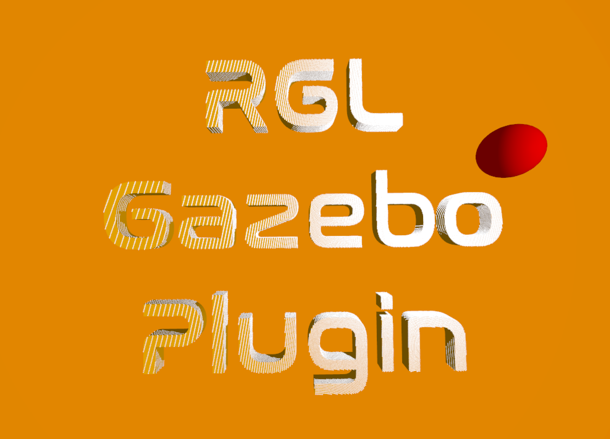
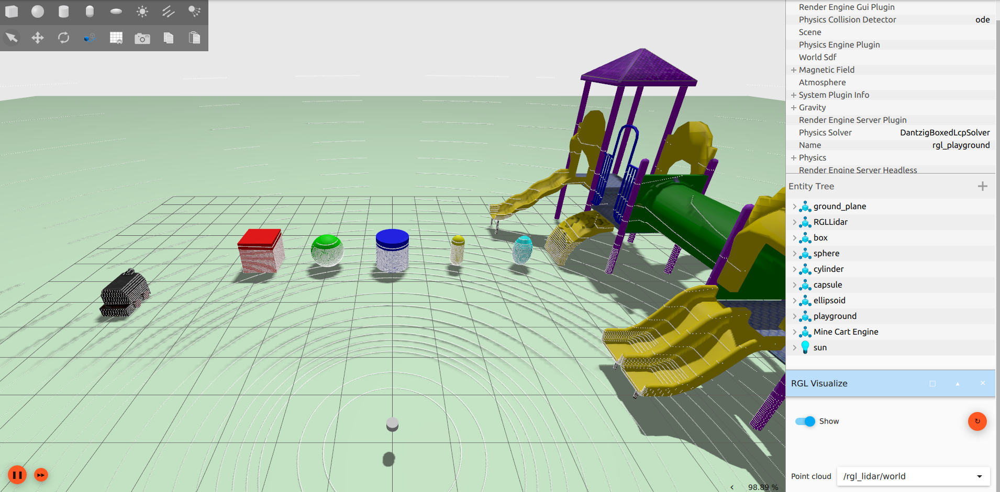
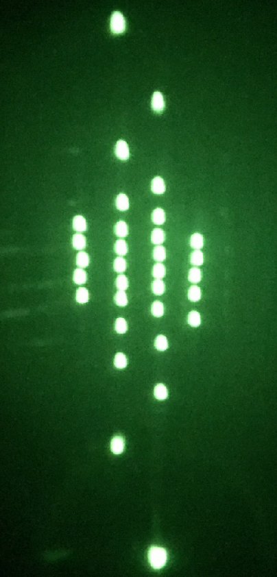
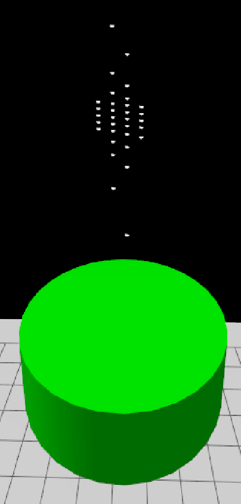
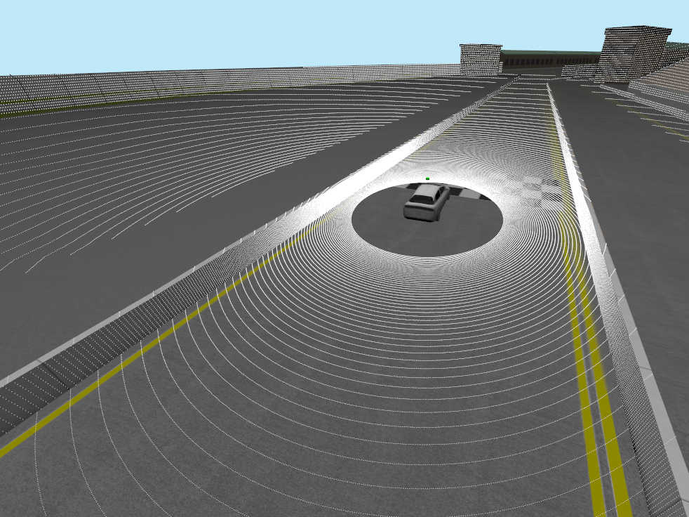
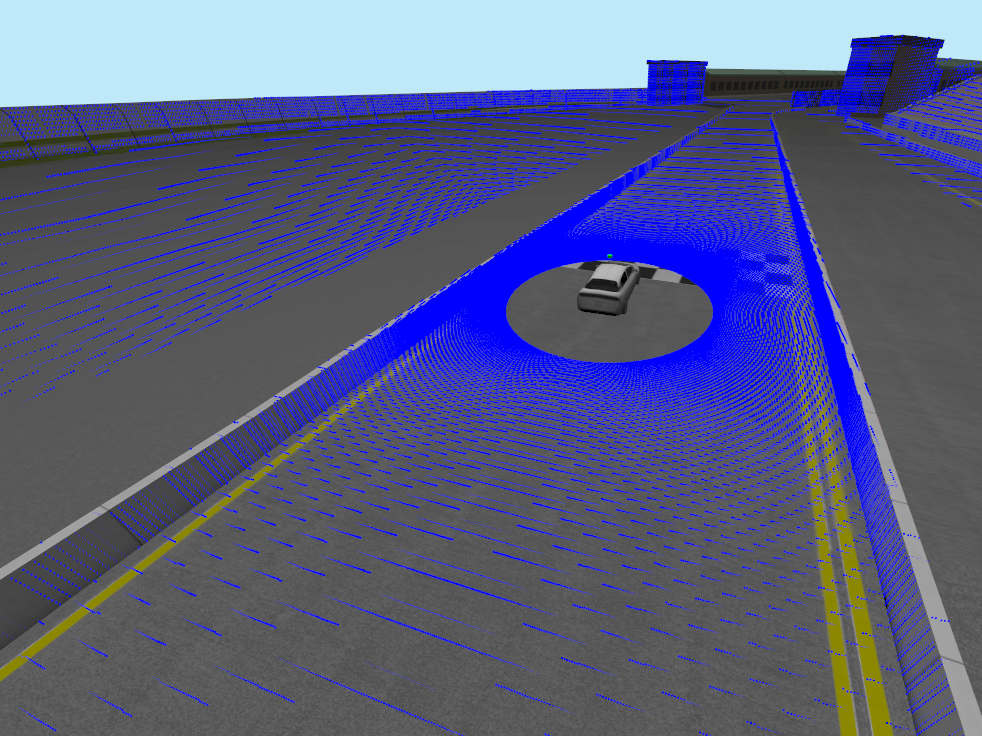

# RGL Gazebo Plugin

---

<h1 align="center">
  
</h1>

---
# About the project

RGL Gazebo Plugin has been created by [Robotec.AI](https://robotec.ai/) to bring [Robotec GPU Lidar](https://github.com/RobotecAI/RobotecGPULidar) to [Gazebo](https://gazebosim.org/home).

Key features:
- Point cloud computation using hardware-accelerated raytracing (Nvidia OptiX)
- High performance (~4x improvement over `gpu_lidar` sensor from Gazebo)
- Multiple LiDAR pattern configuration methods, including importing a pattern from a binary file 
- Realistic presets of the most popular LiDARs

## Requirements:

- OS: [Ubuntu 20.04](https://releases.ubuntu.com/focal/) or [Ubuntu 22.04](https://releases.ubuntu.com/jammy/)

- Gazebo: [Fortress 6.14](https://gazebosim.org/docs/fortress/install)

- GPU: CUDA-enabled

 - Nvidia Driver: [See RGL requirements](https://github.com/RobotecAI/RobotecGPULidar/tree/v0.11.3#runtime-requirements)

## Installation:

### Using pre-built libraries
1. Download libraries from [release](https://github.com/RobotecAI/RGLGazeboPlugin/releases).
2. Make RGL plugins visible to Gazebo:
    - Move libraries to the plugin's directories.
    ```shell
    # If Gazebo installed from apt:
    cp libRobotecGPULidar.so /usr/lib/x86_64-linux-gnu/ign-gazebo-6/plugins/
    cp libRGLServerPluginInstance.so /usr/lib/x86_64-linux-gnu/ign-gazebo-6/plugins/
    cp libRGLServerPluginManager.so /usr/lib/x86_64-linux-gnu/ign-gazebo-6/plugins/
    cp libRGLVisualize.so /usr/lib/x86_64-linux-gnu/ign-gazebo-6/plugins/gui/
    ```
    - Or set environment variables:
    ```shell
    # Assuming that libraries:
    # libRGLServerPluginInstance.so, libRGLServerPluginManager.so and libRobotecGPULidar.so
    # are located in RGLServerPlugin directory,
    # and libRGLVisualize.so in RGLGuiPlugin.
    export IGN_GAZEBO_SYSTEM_PLUGIN_PATH=`pwd`/RGLServerPlugin:$IGN_GAZEBO_SYSTEM_PLUGIN_PATH
    export IGN_GUI_PLUGIN_PATH=`pwd`/RGLGuiPlugin:$IGN_GUI_PLUGIN_PATH
    ```
### Building from source
```shell
mkdir build
cd build
cmake .. # Add `-DRGL_FORCE_DOWNLOAD=ON` to make sure the downloaded RGL will be up-to-date
make -j
make install
cd ..
export IGN_GAZEBO_SYSTEM_PLUGIN_PATH=`pwd`/install/RGLServerPlugin:$IGN_GAZEBO_SYSTEM_PLUGIN_PATH
export IGN_GUI_PLUGIN_PATH=`pwd`/install/RGLVisualize:$IGN_GUI_PLUGIN_PATH
```
## Demo:


Launch the prepared simulation from `test_world` directory:
```shell
ign gazebo sonoma_with_rgl.sdf
```

1. Start the simulation by pressing play
2. The lidar hits should be visible in the GUI
3. You can control the car using the Teleop plugin (preferably changing the steering to the keyboard and upping the speed to 15)

The second sample world (rgl_playground.sdf) contains all supported object types with this plugin. Since the pattern_type is configured as `pattern_preset`, it is required to set `RGL_PATTERNS_DIR` environment variable before running the simulation:
```shell
# From the top-level directory of this repository
export RGL_PATTERNS_DIR=`pwd`/lidar_patterns
ign gazebo test_world/rgl_playground.sdf
```

## Using the plugin:

RGLServerPlugin contains two plugins: `RGLServerPluginManager` and `RGLServerPluginInstance`. For the plugin to work properly, we need to include both.

## How to include RGLServerPluginManager in your sdf:
```xml
<plugin filename="RGLServerPluginManager" name="rgl::RGLServerPluginManager"></plugin>
```
This is a global plugin and should be included only once per sdf, preferably inside the world entity. RGLServerPluginManager is responsible for synchronizing the scene between Gazebo and GPU (CUDA). At the moment manager handles all primitive geometry types (Box, Capsule, Cylinder, Ellipsoid, Sphere), planes, meshes and submeshes.



## How to include RGLServerPluginInstance in your sdf:
Inside the link entity in your model, add a custom sensor:
```xml
<sensor name="UniqueSensorName" type="custom">
  <plugin filename="RGLServerPluginInstance" name="rgl::RGLServerPluginInstance">
    <range>
        <min>0</min>
        <max>100</max>
    </range>
    <update_rate>10</update_rate>
    <update_on_paused_sim>false</update_on_paused_sim>
    <topic>rgl_lidar</topic>
    <frame>RGLLidar</frame>
    <pattern_preset>Alpha Prime</pattern_preset>
  </plugin>
</sensor>
```
*Note: All entities attached to the same \<link\> as lidar will be ignored from raycasting. This enables an adding visual representation of the sensor.*

### Parameters description:
- **range** - the minimum and maximum range that the hits will be registered (in meters).

- **update_rate** - the frequency at which the lidar will perform raycasting (in Hz).

-  **topic** - topic on which pointcloud message (ignition::msgs::PointCloudPacked) will be published. A second topic with the `/world` postfix will also be created for visualization purposes.

- **frame** - frame_id for point cloud message header.

- **update_on_paused_sim** - determines whether the lidar is active when the simulation is paused (optional, default: false).

- **pattern_\<type\>** - definition of the lidar firing pattern. Each type has different parameters described below.

### Pattern types:

- **pattern_uniform**\
  An analog to the gpu_lidar configuration (angles in radians).
  ```xml
  <pattern_uniform>
      <horizontal>
          <samples>1800</samples>
          <min_angle>-3.14159</min_angle>
          <max_angle>3.14159</max_angle>
      </horizontal>
      <vertical>
          <samples>128</samples>
          <min_angle>-0.436332</min_angle>
          <max_angle>0.261799</max_angle>
      </vertical>
  </pattern_uniform>
  ```

- **pattern_custom**\
  **channels** attribute defines the angular position of lidar channels (angles in radians). Horizontal samples are uniformly distributed.
  ```xml
  <pattern_custom channels="0.69 -0.69 0.26 -0.26">
      <horizontal>
          <samples>3600</samples>
          <min_angle>-3.14159</min_angle>
          <max_angle>3.14159</max_angle>
      </horizontal>
  </pattern_custom>
  ```

- **pattern_preset**\
  We have prepared several lidar presets. You can type in the name of a LiDAR to use its pattern (all available patterns are shown below). 
  ```xml
  <pattern_preset>Alpha Prime</pattern_preset>
  <pattern_preset>Puck</pattern_preset>
  <pattern_preset>Ultra Puck</pattern_preset>
  <pattern_preset>OS1 64</pattern_preset>
  <pattern_preset>Pandar64</pattern_preset>
  <pattern_preset>Pandar40P</pattern_preset>
  ```
  **Note:** Before launching the simulation it is required to set `RGL_PATTERNS_DIR` environment variable with the path to pattern presets directory (`lidar_patterns` from repository).
  ```shell
  # For example
  export RGL_PATTERNS_DIR=`pwd`/lidar_patterns
  ```

- **pattern_preset_path**\
  If you wish so, You can create your own preset by providing a binary file with the structure below repeated as many times as you fancy. Please note that an absolute path is required.
  ```c
  /**
   * Row-major matrix with 3 rows and 4 columns of 32-bit floats.
   */
  typedef struct
  {
  	float value[3][4];
  } rgl_mat3x4f;
  ```
  <div style="text-align:center"></div>

  ```xml
  <pattern_preset_path>/home/some1/your-preset.mat3x4f</pattern_preset_path>
  ```

- **pattern_lidar2d**\
  Almost the same as `pattern_uniform` but only has 
  the `horizontal` element and publishes a 
  `LaserScan` message instead of a point cloud
  ```xml
  <pattern_lidar2d>
      <horizontal>
          <samples>1800</samples>
          <min_angle>-3.14159</min_angle>
          <max_angle>3.14159</max_angle>
      </horizontal>
  </pattern_lidar2d>
  ```

## How to visualize in Gazebo
To enable non-uniform point clouds visualization in Gazebo Fortress that are produced by `RGLServerPlugin`, we port [PointCloud gui plugin](https://github.com/gazebosim/gz-gui/tree/gz-gui7/src/plugins/point_cloud) from Gazebo Garden and create `RGLVisualize`. It reimplements the minimal functionality of receiving PointCloudPacked messages (in a world coordinate frame) and rendering them in the scene.

After starting the simulation:
1. Add `RGLVisualize` gui plugin.
2. Select topic with `/world` postfix.

## Level of detail
At [Robotec.AI](https://robotec.ai/) we care about every little detail of our product, so our presets mimic the patterns exactly. We take into account the fact that in many lidars, the lasers are staggered (not positioned exactly one above another), like in the Ultra Puck according to the [manual, page 118](https://icave2.cse.buffalo.edu/resources/sensor-modeling/VLP32CManual.pdf).

| **Ultra Puck one horizontal step pattern** | **RGL digital twin** |
|---|---|
|  |  |

## Ray pattern comparison
| **RGL uniform pattern** | **gpu_lidar uniform pattern** |
|---|---|
|  |  |

## Acknowledgements

The project benefited from significant contributions and support of [Dexory](https://www.dexory.com/).
Features such as LaserScan publishing and Laser Retro as well as update to the newest RGL version were possible thanks to their dedication to the open source community.
