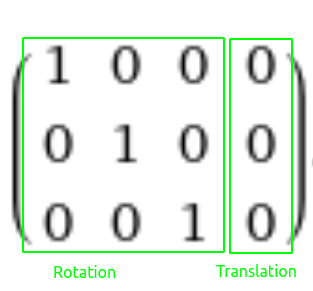
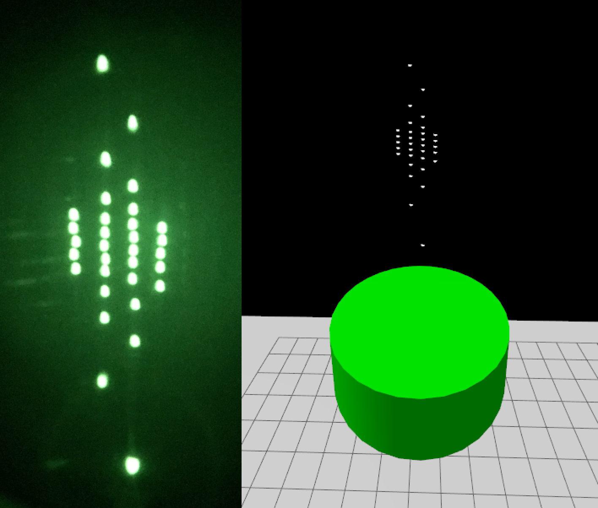
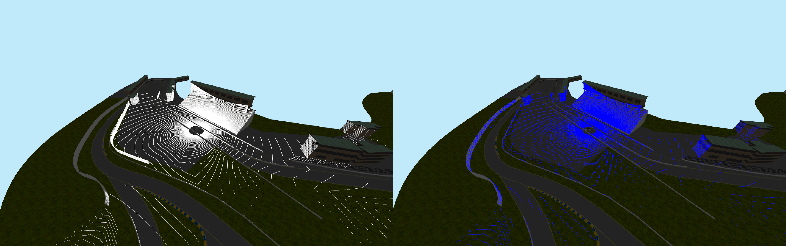

# RGL Gazebo Plugin

---

<h1 align="center">
  
</h1>

---
# About the project

RGL Gazebo Plugin has been created by [Robotec.AI](https://robotec.ai/) to bring [Robotec GPU Lidar](https://github.com/RobotecAI/RobotecGPULidar) to [Gazebo](https://gazebosim.org/home).

Key features:
- Point cloud computation using hardware-accelerated raytracing (Nvidia OptiX)
- High performance (2x improvement over `gpu_lidar` sensor from Gazebo)
- Multiple LiDAR pattern configuration methods, including importing a pattern from a binary file 
- Realistic presets of the most popular LiDARs

## Requirements:

OS: [Ubuntu 20.04 Focal Fossa](https://releases.ubuntu.com/20.04.5/?_ga=2.210010709.1162335333.1667845331-1529863968.1667845331)

Gazebo: [Fortress 6.12](https://gazebosim.org/docs/fortress/install)

GPU: [Nvidia Pascal](https://en.wikipedia.org/wiki/Pascal_(microarchitecture)) architecture or newer (preferably with RT cores)

Nvidia Driver: [See RGL requirements](https://github.com/RobotecAI/RobotecGPULidar#runtime-requirements)

## Installation:
From RGLGazeboPlugin directory:

```shell
mkdir build
cd build
cmake ..
make -j
export IGN_GAZEBO_SYSTEM_PLUGIN_PATH=`pwd`/RGLServerPlugin
export IGN_GUI_PLUGIN_PATH=`pwd`/RGLVisualize
```
## Demo:


From RGLGazeboPlugin directory:
```shell
cd test_world
ign gazebo prius_world_RGL.sdf
```

1. Start the simulation by pressing play
2. The lidar hits should be visible in the GUI
3. You can control the car using the Teleop plugin (preferably changing the steering to keyboard and upping the speed to 15)

## Using the plugin:

For the plugin to work properly, we need to include both RGLServerPluginManager and RGLServerPluginInstance(s):

## How to include RGLServerPluginManager in your sdf:
```xml
<plugin filename="RGLServerPluginManager" name="rgl::RGLServerPluginManager"></plugin>
```
This is a global plugin and should be included only once per sdf, preferably inside the world entity. 
## How to include RGLServerPluginInstance in your sdf:
```xml
<plugin filename="RGLServerPluginInstance" name="rgl::RGLServerPluginInstance"></plugin>
```
Note that the lidar will be attached to the entity that the instance inclusion is inside and will ignore all children (recursively) of the entity as well as the entity that it is attached to.
## RGLServerPluginInstance settings:
The basic lidar parameters can be set as shown below. The LiDAR firing pattern can be created using the following methods (described in the following sections):  `uniform`, `custom`, `preset`, and `preset_path`.
```xml
<plugin filename="RGLServerPluginInstance" name="rgl::RGLServerPluginInstance">
    <range>245</range>
    <update_rate>10</update_rate>
    <always_on>false</always_on>
</plugin>
```
**range** - the maximum range that the hits will be registered

**update_rate** - the frequency at which the lidar will perform raycasting (in Hz)

**always_on** - determines whether the lidar is active when the simulation is paused

### Uniform Pattern
An analogue to the gpu_lidar configuration (angles in radians).
```xml
<uniform_pattern>
    <horizontal>
        <samples>1800</samples>
        <min_angle>-3.14159</min_angle>
        <max_angle>3.14159</max_angle>
    </horizontal>
    <vertical>
        <samples>128</samples>
        <min_angle>-0.436332</min_angle>
        <max_angle>0.261799</max_angle>
    </vertical>
</uniform_pattern>
```

### Custom Pattern
**lasers** argument defines the vertical angles of each layer (angles in radians), horizontal samples are uniformly distributed
```xml
<custom lasers="0.698132 -0.698132 0.261799687000294 -0.261799687000294">
    <horizontal>
        <samples>3600</samples>
        <min_angle>-3.14159</min_angle>
        <max_angle>3.14159</max_angle>
    </horizontal>
</custom>
```

### Preset
You can type in the name of a LiDAR to use its pattern (all available patterns are shown below).
```xml
<preset>Alpha Prime</preset>
<preset>Puck</preset>
<preset>Ultra Puck</preset>
<preset>OS1 64</preset>
<preset>Pandar64</preset>
<preset>Pandar40P</preset>
```

### Preset Path
If you wish so, You can create your own preset by providing a binary file with the structure below repeated as many times as you fancy. Please note that an absolute path is required.
```c
/**
 * Row-major matrix with 3 rows and 4 columns of 32-bit floats.
 */
typedef struct
{
	float value[3][4];
} rgl_mat3x4f;
```

```xml
<preset_path>/home/some1/Downloads/lidars-for-gazebo/VelodyneVLS128.mat3x4f</preset_path>
```
## Level of detail
At [ROBOTEC.AI](https://robotec.ai/) we care about every little detail of our product, so our presets mimic the patterns exactly, we even take into account the fact that in many lidars the lasers are staggered (not positioned exactly one above another), like in the Ultra Puck according to the [manual, page 118](https://icave2.cse.buffalo.edu/resources/sensor-modeling/VLP32CManual.pdf).


## Ray pattern accuracy comparison of RGL (left) and gpu_lidar (right)

